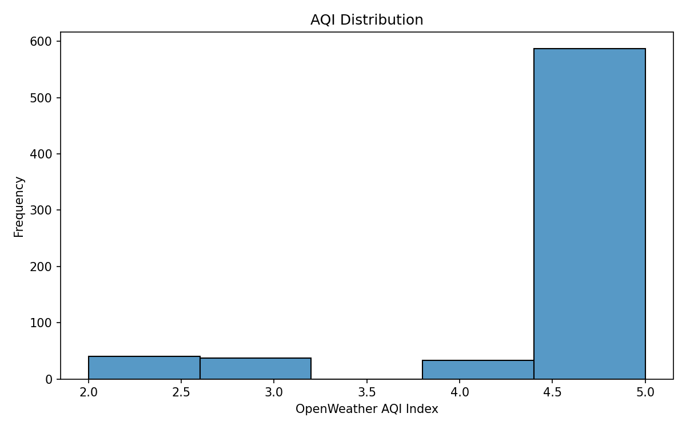
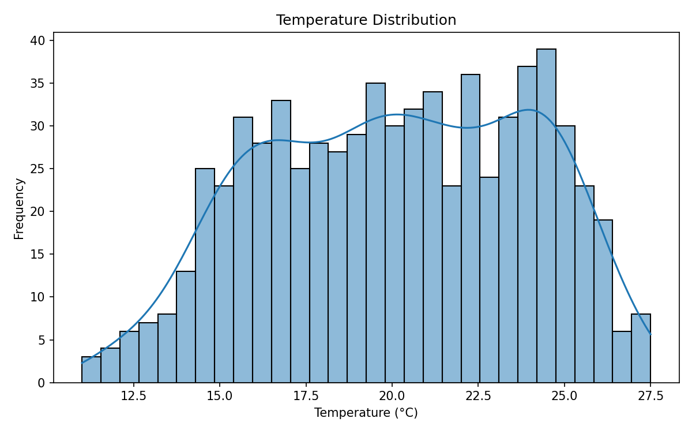
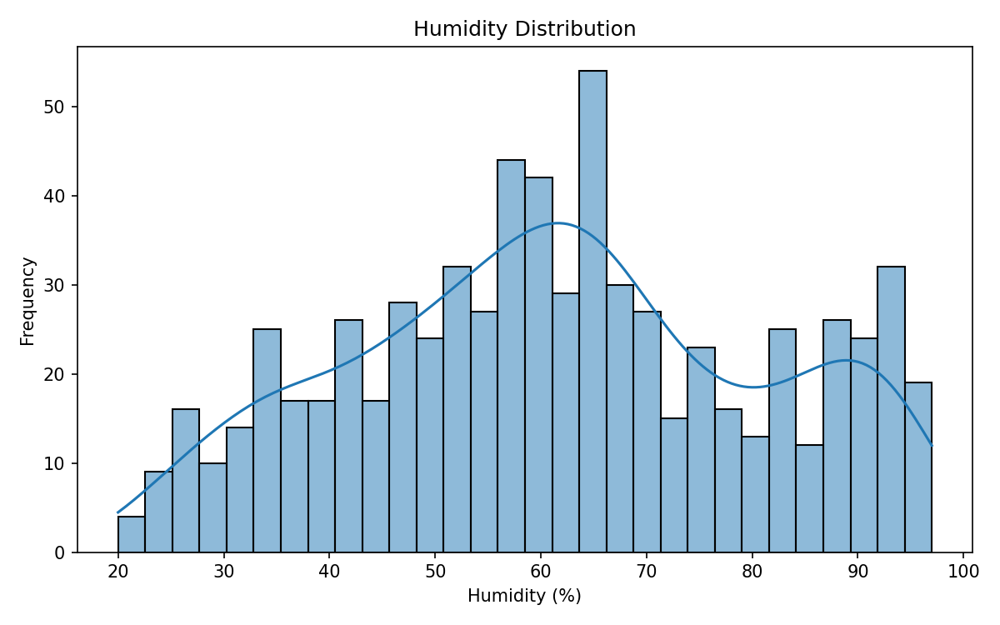
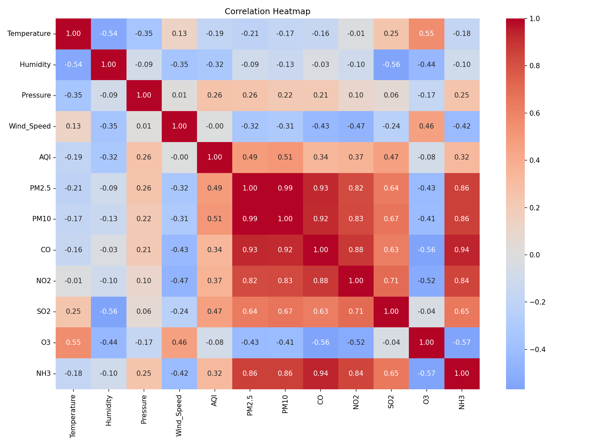
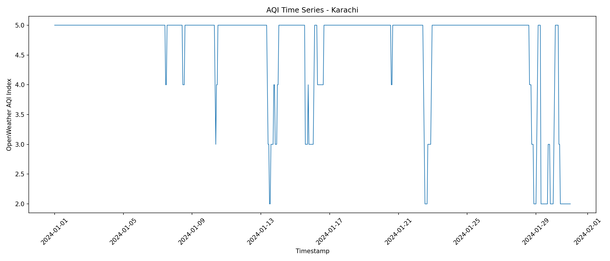

# Pearls AQI Predictor — Exploratory Data Analysis Report

## 1. Dataset Overview

The dataset used for this EDA is the cleaned historical dataset generated
during the historical data collection, merging and preprocessing phases.

### Dataset Information

- **City:** Karachi
- **Dataset type:** Historical hourly weather and air-pollution data
- **Target variable:** AQI
- **Input file:** `data/processed/cleaned_data.csv`

### Features

The dataset contains the following major features:

- Timestamp
- City
- Temperature
- Humidity
- Pressure
- Wind Speed
- AQI
- PM2.5
- PM10
- CO
- NO2
- SO2
- O3
- NH3

---

## 2. Dataset Quality

The preprocessing pipeline was executed before EDA.

The preprocessing stage:

- Removed duplicate records
- Handled missing values
- Converted timestamps to datetime
- Sorted records chronologically
- Validated required columns

The EDA script also checks missing values and timestamp gaps.

---

## 3. Summary Statistics

Summary statistics were generated using Pandas `describe()`.

The statistics include:

- Count
- Mean
- Standard deviation
- Minimum
- 25th percentile
- Median
- 75th percentile
- Maximum

These statistics help understand the distribution and scale of the
weather and pollutant variables.

---

## 4. AQI Distribution



The AQI distribution shows the frequency of different AQI index values
in the historical Karachi dataset.

### Important Note

The AQI column comes from the OpenWeather air-pollution API and uses an
**AQI index from 1 to 5**.

Therefore, these values should not be interpreted as a conventional
0–500 AQI score.

The AQI distribution will be used to understand the target variable
before model training.

---

## 5. Temperature Distribution



The temperature histogram shows the distribution of recorded temperatures
during the historical period.

Temperature is included as an important weather-related feature because
weather conditions can influence pollutant concentration and air quality.

---

## 6. Humidity Distribution



The humidity histogram shows the spread of humidity observations.

Humidity may have a relationship with pollutant concentration and is
therefore considered as a potential predictive feature.

---

## 7. Correlation Analysis



The correlation heatmap shows the linear relationships between the
numerical variables.

It helps identify:

- Features strongly correlated with AQI
- Relationships between pollutants
- Relationships between weather variables
- Potentially useful predictive features

The strongest relationships should be evaluated carefully because
correlation does not necessarily imply causation.

---

## 8. Time-Series Analysis



The time-series plot shows AQI changes over the historical period.

Time-series analysis is especially important for this project because
the final objective is to forecast AQI for future time periods.

The chronological order of the observations must therefore be preserved
during future model training.

---

## 9. AQI Change Rate

AQI change features were explored as part of the EDA.

### AQI Change

```text
Current AQI - Previous AQI